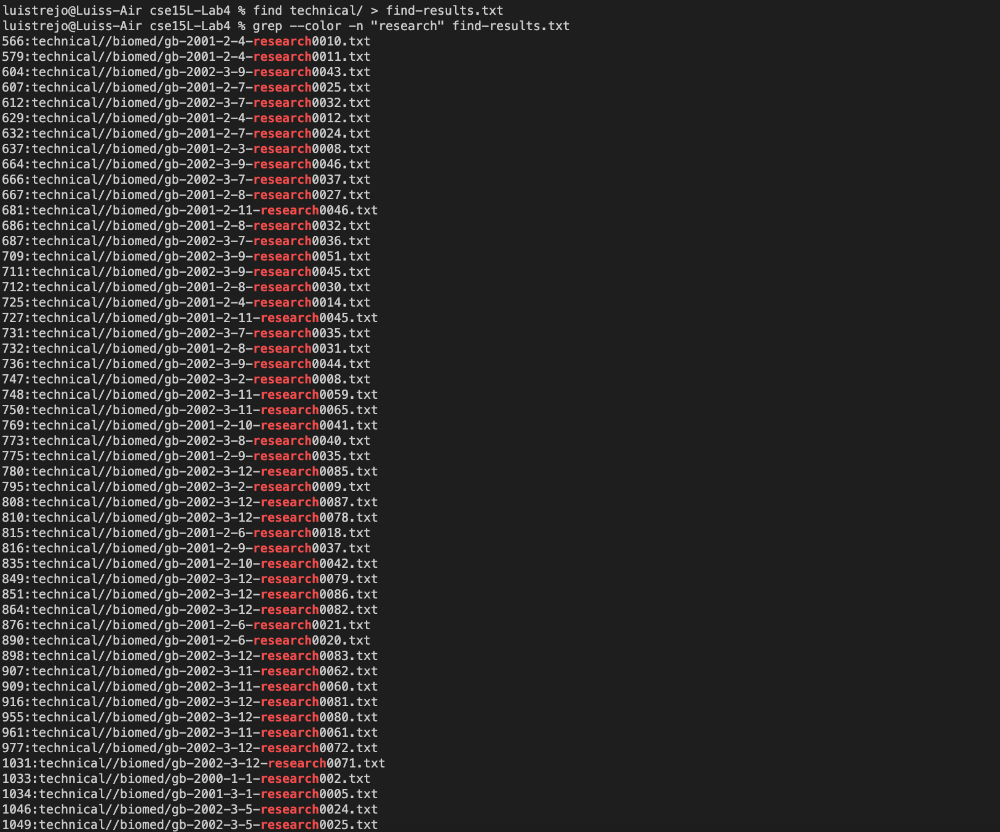
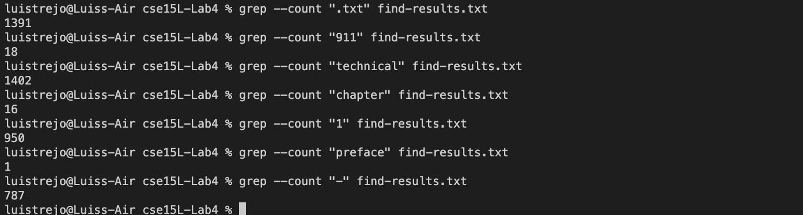
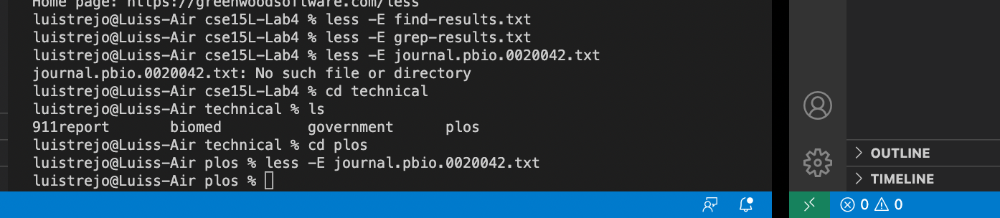
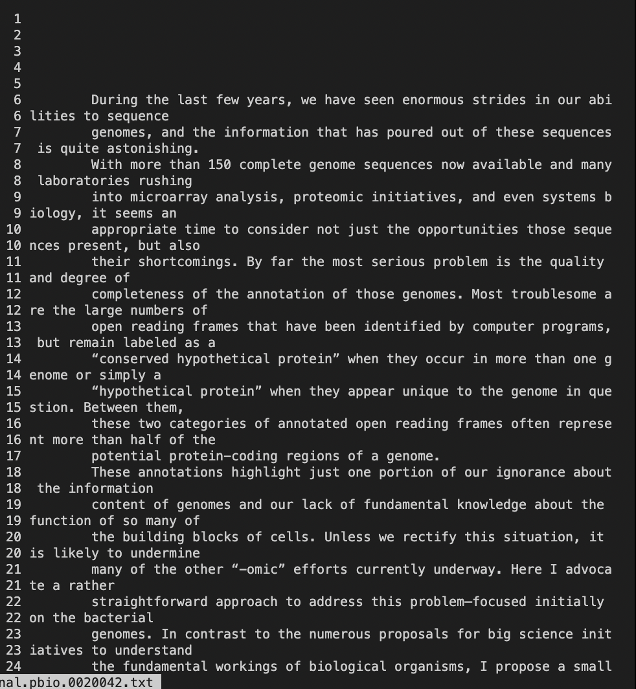
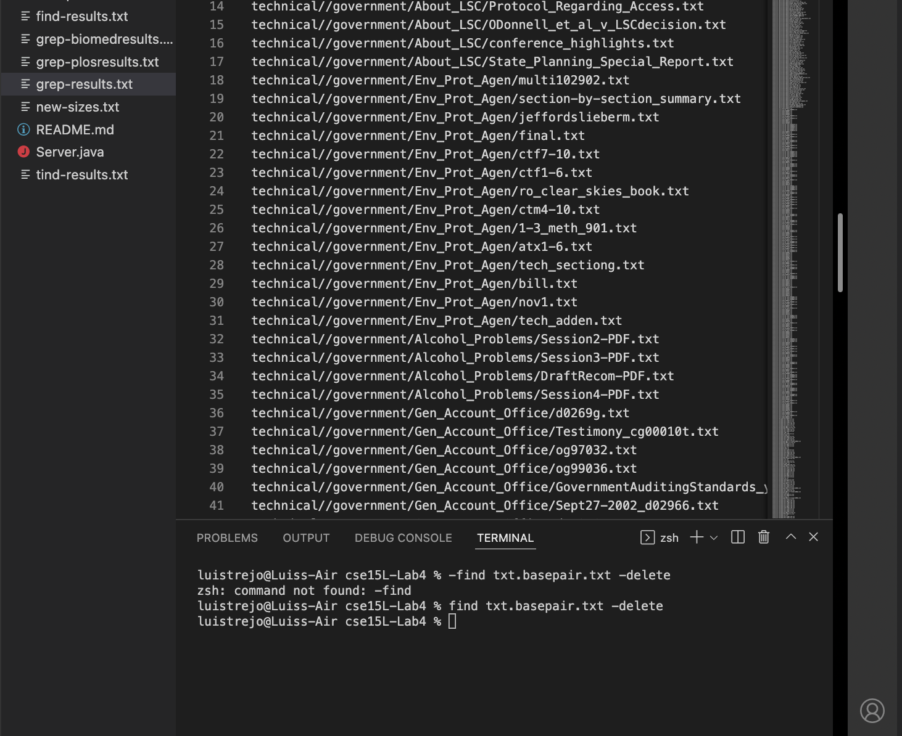
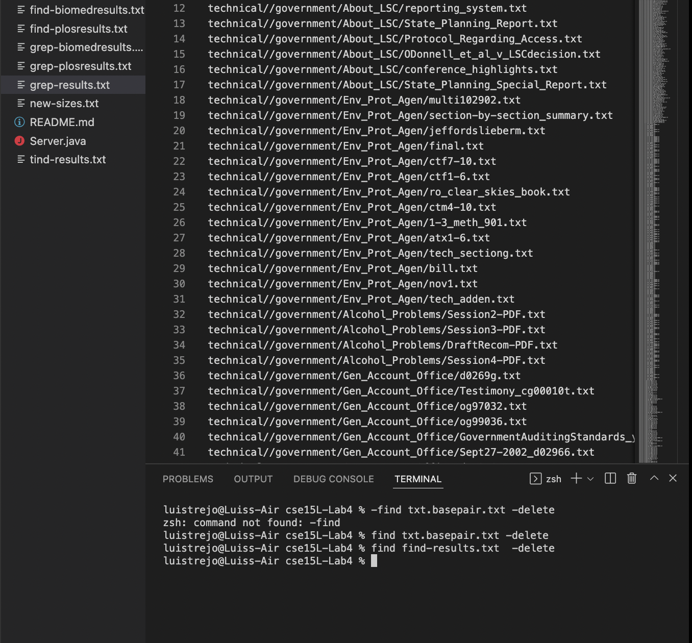

# Lab Report # 3 (Week 5)

> The goal for this lab report is to be able to be able to grow our understanding of how command line works mainly grep, less, and find commands on the terminal and how to uniquely use them in the terminal in three ways for each one. 

** 

## Grep Line Command

- I will start off with  **Grep** and as some context the meaning of Grep stands for " Global Regular Expression Print ", which think I heard that was what it meant, but I wasn't to sure.
-   The syntax of how grep works;

>  grep [Options] Pattern [File..]

*** 

>> Acknowledgement: This syntax was copied from [ComputerHope.com](https://www.computerhope.com/unix/ugrep.htm)

### Unique Line command for Grep (#1) `Color`

1. From the beginning of /technical code from Lab #4, you have to first of all is create txt of all the .txt by using find technical. The syntax of this code is given in the lab which is;

> find technical/  > find-results.txt

(P.S The find command is going to be very important for future letures and it is, in my opinion going to be very important.)

2. Using find-results.txt you can then use grep ' color ' and it should look like this;

Screenshot of the work:

> In this what 'color' does is that it takes in a certain expression and colors that certain expression into a different color in this case, red and prints out the certain expression in this case "2001".

- The syntax of how this works is **grep --color -n "Expression" certain.txt**

- This can be benefitial whenever we are looking for keyterms in the code especially in certain .txt files. (Pretty Useful) 

## 2nd Example of `Color` used

- In this image what we end up doing is identifying is the term "research" and in this

***

### Unique Line command for Grep (#2) `--invert-match`

1. Similar to Step 1.  in for #1 in Grep, we have to create a code that connects the information from the technical code.

2.  Afterwards, use that find-results.txt and then in the terminal you can write grep `--invert-match` and you should get something similiar to what the screenshots looks like below;

> The idea here is that it search for files that **doesn't** contain what the expression has in that certain .txt file.

-  The syntax of how this works is **grep --invert-match "expression" certain.txt**

- This I believe can be useful in many ways especially by identifying if an of the files that you wrote / created isn't written as asked, and this functions helps out with that.

- (P.S: For these in-line arguments can serve for more purposes, but these ideas are ones that I believe is right.)

***

### Unique Line command for Grep (#3) `--count`

1. Redo Step #1 for Grep in the previous two examples.

2. Next, use that unique .txt and then in the terminal you can write grep `--count` and you should get something similar to the screenshot below;

> The purpose of this is pretty simple it is just checking a specific expression of the file that you wrote in the terminal. 

- For me, I believe that this is a more detailed wordcount where it is looking how many lines contain the specfic expression that you write in the terminal.

- I believe this really useful to see if a certain assignment has a good quantity of that certain expression, for example ".txt" does it have more than 50 for this project? You could just type that in the terminal and end up getting your answer.

***

## Less Line Command

- Next up is less line command where this less command in the terminal, what the less function does is that it gives you a version of the file in the terminal so you don't have to go looking for a certain file and read it

- The syntax of how find `less` works

> less  \\file-path// (so any file .txt could work)

**

//

### Unique Line Command  for less(#1): `-E`

1. In this to make it work you need to use a .txt file and any should work and it should be alright in this example we are using a journal.pbio in the plos directory inside of the technical directory.

2. To get to step 1, you must use cd technical which changes you to the directory of the technical, then use cd plos so that you can access the journals that are given.

3. Then you want to write something like this;

> P.S the reason why you need cd is because the .txt file doesn't exist in the current directory and you need to go all the way into directory in the plos directory.

4. Once you write the syntax of;

> less -E //file-path//

5. Once you write it you should get something like this;

> The purpose of this is that without the -E, you get the same output but by just adding -E, it closes automatically which you would have to type in q.

- Even though it isn't much that it helps out, it can really help you when you forget to type q, because that is what happened to me and I had to check my notes again, so with this I don't need to remember.

- Only big con of this, is once you reach the end by scrolling then it ends up taking you back to the first screenshot by step 3.

### Unique Line Command for Less(#2); `-N`

1. Use the first two steps to help you guide you to the terminal to write your answer.

2. Then in the terminal you want to write something like this:

> The purpose of this is somthing mainly involving with organization, as this is the output that it gives.

> What it produces is numbers and lines in the left side of text/ in the file that is given.

- This is useful, so that you organize and point out errors on the files with line numbers and not just say in the line about this.

- Something unique about this is that you can use both -N and -E at the same time 

### Unique Line Command for Less(#3); `Open Multiple Files`

1. Do the same first two steps from #1 of Less.

2. Then you have to write in your terminal something like this;

> What this does is just gets the two paths and basically just prints it out in the output. 
- P.S It also works with -N and -E!

-Syntax: less //file-path1// //file-path2// ...

3. If you typed it correctly you get something like this.

4. Once you get this at the end of the first file you have to type in `:` key then followed up by `n` key and with that you can go to the next page. 

> This is super beneficial as with this you can look at the most important files by typing this in the termnal, by the way you can defintly add more then 2 files at the same time...

***

## Find Line Command

- The Find Command is most like going to be one of the more important ones to learn as this can help you produce entire .txts of almost anything so this will be useful for future in line commands.

Syntax: find //directories/files/.txt/...//(almost anything practicially)

### Unique Line Command for Find(#1); `Empty`

1. For this one you don't need any prep before the question.

2. By typing in the syntax `find . -empty` you end up getting unique answers like this;

> In this image, it is explaining that by using this command, it identifies if something is empty or not.

- In this case, some paths that are "empty" and have nothing in it.
- This can be useful, if you have a lot of files and paths and are missing data or information in a certain path, or if they were meant to be empty.

### Unique Line Command for Find(#2); `Delete`

1. This one is very useful but you must be careful with this one because if you commit an error it can **erase everything** so do this with caution and make sure to save it on desktop before doing this one, just in case you mess up.

2. The syntax of this one is `find . -delete` (please don't enter this, unless you are aware of what it does, it erases everything.)

- An example of this helping and working is like this 

> In this code, please pay attention that we still have find-results.txt. Now please look at this;

> As you can see, we used the terminal to get rid of find-results.txt, in this case, it wasn't helpful at all, but whenever you have dupicate files, your friend will be -delete, but use it with caution, if used in correctly it can erase everything.

### Unique Lind Command for Find(#3); `-Size`

1. Use the syntax;
find . -size -/+n -type f
(I don't know if -type f works with everyone.)

2. With this command you can tell if something is bigger or smaller than a certain size that would replace the "n" variable.

3. The variables that can be used is c(for bytes),w(two-byte words), k(for kilobytes), M (for megabytes)...

4. In the example that I made is out of k variable which would be kilobytes which I got this;

> Can be very useful when try to set up hard limits on certain files in a job or school/university projects.