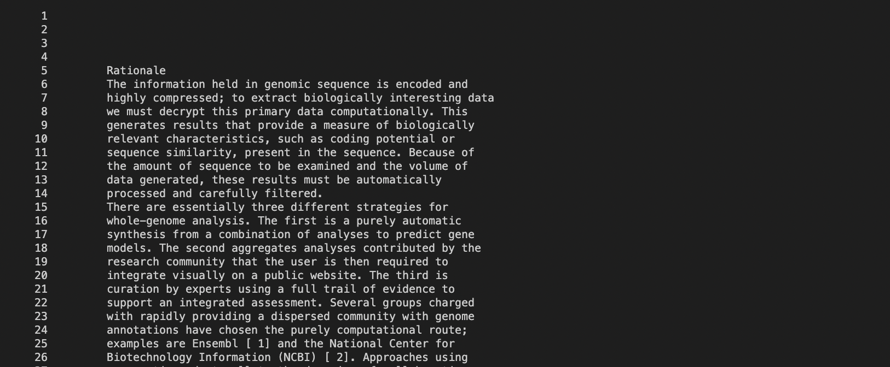
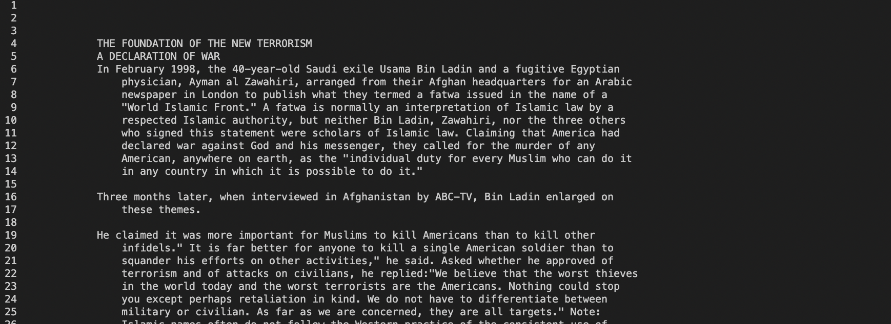

# Lab Report # 3 (Week 5)

> The goal for this lab report is to be able to be able to grow our understanding of how command line works mainly grep, less, and find commands on the terminal and how to uniquely use them in the terminal in three ways for each one. 

** 

## Grep Line Command

- I will start off with  **Grep** and as some context the meaning of Grep stands for " Global Regular Expression Print ", which think I heard that was what it meant, but I wasn't to sure.
-   The syntax of how grep works;

>  grep [Options] Pattern [File..]

*** 

>> Acknowledgement: This syntax was copied from [ComputerHope.com](https://www.computerhope.com/unix/ugrep.htm)

### Unique Line command for Grep (#1) `Color`

1. From the beginning of /technical code from Lab #4, you have to first of all is create txt of all the .txt by using find technical. The syntax of this code is given in the lab which is;

> find technical/  > find-results.txt

(P.S The find command is going to be very important for future letures and it is, in my opinion going to be very important.)

2. Using find-results.txt you can then use grep ' color ' and it should look like this;

Screenshot of the work:

> In this what 'color' does is that it takes in a certain expression and colors that certain expression into a different color in this case, red and prints out the certain expression in this case "2001".

- The syntax of how this works is **grep --color -n "Expression" certain.txt**

- This can be benefitial whenever we are looking for keyterms in the code especially in certain .txt files. (Pretty Useful) 

## 2nd Example of `Color` used

- In this image what we end up doing is identifying is the term "research" and in this example which we are looking up at all the files that contain the word "research"

## 3rd Example of `Color` used 

- In this image we used a more easy number which would be "20" as our search.
- Of course because 20 is more of a basic number then 2001, in the terminal there is way more files for 20 then 2001.
***

### Unique Line Command for Less(#1); `Open Multiple Files`

1. Do the same first two steps from #1 of Less.

2. Then you have to write in your terminal something like this;

> What this does is just gets the two paths and basically just prints it out in the output. 
- P.S It also works with -N and -E!
- -N: Helps out with organization and puts numbers for each line in the file.
- -E: Helps you by basically printing out the files in the terminal, and you can exit it by q key.

-Syntax: `less //file-path1// //file-path2// ...`

3. If you typed it correctly you get something like this.

4. Once you get this at the end of the first file you have to type in `:` key then followed up by `n` key and with that you can go to the next page. 

> This is super beneficial as with this you can look at the most important files by typing this in the termnal, by the way you can defintly add more then 2 files at the same time...

## 2nd Example out getting multiple files 

- You would start off with making the command and should be like this;

> Rememeber, to change the directories to make this work and for this you have to `cd technical` and then this time `cd biomed` instead of `cd plos` for this example.

- Then when you have it, you should see something like this:

- With this you can see the first file that you wanted to see, then by using `:n` you can move on to the next file that you put, like this. 

- To leave just press the q key and to go back completely and out of cd of biomed you use `cd ..`

## 3rd Example out getting multiple files 

- You would start off with making the command and should be like this;

> Rememeber, to change the directories to make this work and for this you have to `cd technical` and then this time `cd 911report` instead of `cd plos` and `cd biomed` for this example.

- Then when you have it, you should see something like this:

- With this you can see the first file that you wanted to see, then by using `:n` you can move on to the next file that you put, like this. 

- To leave just press the q key and to go back completely and out of cd of biomed you use `cd ..`

***

## Find Line Command

- The Find Command is most like going to be one of the more important ones to learn as this can help you produce entire .txts of almost anything so this will be useful for future in line commands.

Syntax: find //directories/files/.txt/...//(almost anything practicially)

### Unique Find Command for Find(#1); `-Size`

1. Use the syntax;
find . -size -/+n -type f
(I don't know if -type f works with everyone.)

2. With this command you can tell if something is bigger or smaller than a certain size that would replace the "n" variable.

3. The variables that can be used is c(for bytes),w(two-byte words), k(for kilobytes), M (for megabytes)...

4. In the example that I made is out of k variable which would be kilobytes which I got this;

## Second Example of Size for Find

- In this example, instead of finding anything that is less then a kilobyte let us try anything that is greater than 100 kilobyte. 

- So the example should look like this;

- We don't want to use +1k because most of the file are actually greater then 1 or even 10 kilobytes and the best choice would be 100k to check out. 

## Third Example of Sizze for Find 

- In this example, instead of finding kilobytes lets try a megabyte or 1000 kilobytes. 

-So the example should look like this;

- In this one, there is only one file that is 1 megabyte or bigger and it is actually a package instead.

> Can be very useful when try to set up hard limits on certain files in a job or school/university projects.
